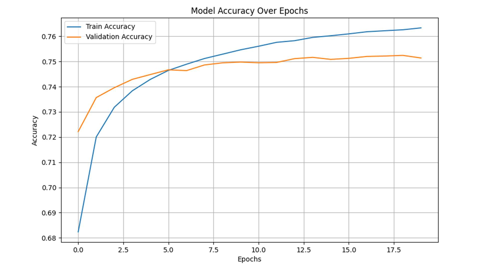

# 🚗 NYC Parking Violations Prediction Model

This project develops and evaluates a **neural network** to predict:
1. **Violation Codes** (58.43% accuracy, a 31.1% improvement over prior models).
2. **Fine Amounts** (75.14% accuracy, with a revenue prediction error of 0.42%).

The aim is to estimate potential revenue from parking fines in NYC, optimizing resource allocation for agencies like the NYPD.

---

## 📜 Introduction/Abstract

A **TensorFlow/Keras Neural Network** was trained and evaluated on data from **NYC OpenData**, targeting the fiscal year of 2024. Key achievements:
- **Violation Code Prediction**: 58.43% test accuracy (31.1% improvement over Downey's model [1]).
- **Fine Amount Prediction**: 75.14% test accuracy, resulting in an estimated revenue of **$33,892,030**, compared to the actual revenue of **$34,036,230**—a **0.42% error**.

---

## ❓ Problem Statement

In fiscal year 2023, NYC issued **$1.16 billion** in parking and camera fines, a significant revenue stream. However:
- Limited resources require efficient allocation for policing and issuing fines.
- Accurate predictions of revenue can help optimize resource deployment.

This project aims to solve these challenges by predicting revenue based on features such as **time**, **location**, and **vehicle type**.

---

## 📊 Dataset

The dataset was sourced from [NYC OpenData](https://data.cityofnewyork.us/City-Government/Parking-Violations-Issued-Fiscal-Year-2024/pvqr-7yc4). It includes parking violations issued between **September 1st and February 28th**, providing sufficient training data for the machine learning model.

- **Categorical vs. Numerical Features**: Most features are categorical, with limited numerical data.

### Figure 1: Jupyter Lab Output of Initial Dataset


---

## 💡 Other Models/Projects

### Previous Work:
1. **Ramanathan et al.**:
   - Used **XGBoostClassifier** and **RandomForestClassifier**.
   - Predicted borough locations with **99.9%** and **95% accuracy**, respectively.
   - Limitations: Relied on features directly dependent on the output, reducing real-world applicability.
   
2. **Taylor Downey**:
   - Developed a **Keras neural network** for violation code prediction.
   - Achieved **45.40% accuracy** using independent, descriptive features.

### Improvements in This Project:
- **Cyclic Encoding for Time**: Encoded `Hour of Day` as sine and cosine.
- **Fine Amount Prediction**: Predicted fines directly for better accuracy and utility.

---

## 🔍 Feature Selection and Preprocessing

### Selected Features:
1. `Vehicle Body Type`
2. `Vehicle Make`
3. `Vehicle Color`
4. `Violation County`
5. `Street Code1`, `Street Code2`, `Street Code3`
6. `Issuing Agency`, `Plate Type`
7. `Violation Precinct`, `Registration State`
8. `Day of Week`, `Hour of Day` (encoded cyclically)

### Preprocessing Steps:
1. **Mapping Fine Amounts**: Fine amounts were mapped to violation codes using external data.
2. **Reducing Categories**: Grouped `Vehicle Color` into **14 major categories** (from 349 unique values).
3. **Dropping Missing Values**: Removed rows with NaN values to avoid overfitting.
4. **Cyclic Encoding**: Encoded `Hour of Day` as sine and cosine for temporal representation.

### Figure 2: Feature Selection, Encoding, and Normalization


---

## 🤖 Model Architecture

A **Feedforward Neural Network** was built using TensorFlow/Keras:
- **Input Features**: 19,181 after preprocessing.
- **Hidden Layers**:
  - Layer 1: 128 units with ReLU activation.
  - Layer 2: 64 units with ReLU activation.
- **Dropout Layers**: 30% dropout rate to prevent overfitting.
- **Output Layer**: Softmax activation for multi-class classification.
- **Optimizer**: Adam.
- **Loss Function**: Categorical Cross-Entropy.

### Figure 3: Neural Network Model Code


---

## 📈 Training and Results

### **Violation Code Prediction**
- **Accuracy**: 58.43%.
- **Revenue Prediction**:
  - Predicted Revenue: **$34,944,600**.
  - Actual Revenue: **$34,036,230**.
  - Error: **~5%**.

### Figure 4: Violation Code Prediction Accuracy


### Figure 5: Violation Code Loss


---

### **Fine Amount Prediction**
- **Accuracy**: 75.14%.
- **Revenue Prediction**:
  - Predicted Revenue: **$33,892,030**.
  - Actual Revenue: **$34,036,230**.
  - Error: **0.42%**.

### Figure 6: Fine Amount Prediction Accuracy


### Figure 7: Fine Amount Loss


---

## 🏁 Conclusion

Both models provided accurate revenue predictions:
- **Violation Code Model**: Useful for multi-class classification but limited in capturing patterns between inputs and outputs.
- **Fine Amount Model**: Better performance, highlighting the importance of direct target prediction.

**Key Takeaways**:
- High-quality feature selection (e.g., cyclic time encoding, reduced categorical variables) is critical.
- Dataset limitations (e.g., lack of demographic data) affect predictive accuracy.
- Even complex models rely on well-processed data for optimal performance.

---

## 📚 Citations

1. **Taylor Downey (2022)** - [ticket_analysis GitHub Repo](https://github.com/tadowney/ticket_analysis)
2. **Vishwesh Ramanathan et al. (2020)** - [Real-Time Prediction Project Report](https://github.com/Vishwesh4/Real-time-prediction)
3. **NYC Treasury & Payment Services (2023)** - [Annual Report of NYC Parking Tickets and Camera Violations](https://www.nyc.gov/assets/finance/downloads/pdf/23pdf/2023-local-law-6-report.pdf)
4. **NYC OpenData** - [Parking Violations Issued - Fiscal Year 2024](https://data.cityofnewyork.us/City-Government/Parking-Violations-Issued-Fiscal-Year-2024/pvqr-7yc4)

---

## 📂 How to Run

1. Clone the repository:
   ```bash
   git clone https://github.com/your-username/NYC-Parking-Violations-Prediction-Model.git


2. Go to project directory:
   ```bash
   cd NYC-Parking-Violations-Prediction-Model

3. Install Dependencies:
   ```bash
   pip install -r requirements.txt

4. To run training script:
   ```bash
   python main.py

Or, you can directly predict on the saved neural network models
